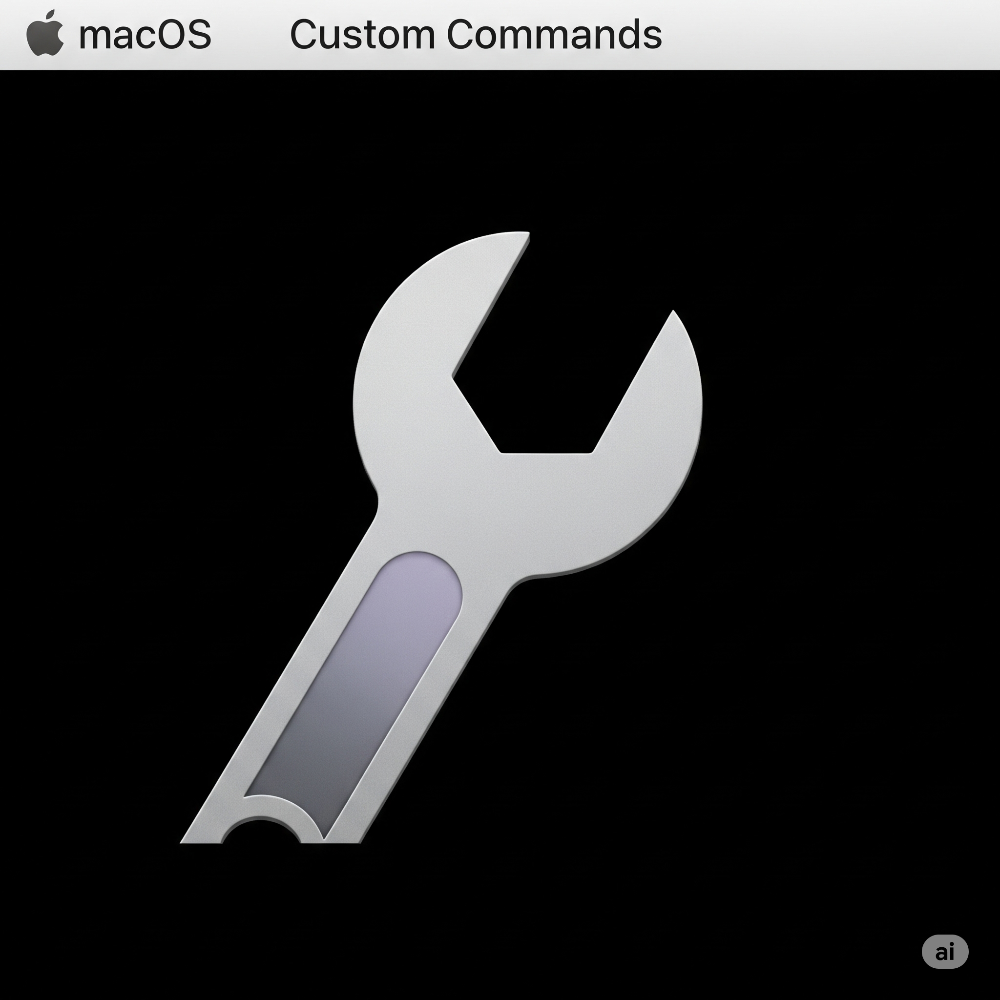

# ToolExecutor

一個優雅的 macOS 工具，讓您快速執行常用的命令行工具。

## 功能特點

✨ **雙重執行模式**
- **背景執行**：在後台靜默執行命令，通過系統通知查看結果
- **終端執行**：在 Terminal.app 中執行命令，實時查看輸出和互動

🎯 **直觀的管理介面**
- 現代化的 SwiftUI 界面設計
- 可視化的命令管理（新增、編輯、刪除）
- 即時搜尋和篩選功能
- 一鍵啟用/停用命令

⚡ **便捷的狀態欄操作**
- 系統狀態欄快速存取
- 每個命令都提供背景執行和終端執行選項
- 支援子菜單操作

🔧 **預設實用命令**
- 開啟終端機
- 查看系統資訊和進程
- 網路連接測試
- 磁碟和記憶體使用情況
- 更多實用工具...

## 使用方式

### 主界面操作

1. **新增命令**：點擊右上角的 "+" 按鈕
2. **執行命令**：選擇 "背景執行" 或 "終端執行"
   - **背景執行**：適合需要靜默運行的命令
   - **終端執行**：適合需要查看輸出或互動的命令
3. **編輯命令**：點擊命令卡片的 "編輯" 按鈕
4. **搜尋命令**：使用頂部的搜尋欄快速找到命令

### 狀態欄快速存取

1. 點擊狀態欄中的 ToolExecutor 圖示
2. 選擇要執行的命令
3. 在子菜單中選擇執行方式：
   - **背景執行**：直接在後台運行
   - **在終端執行**：在 Terminal.app 中打開執行

## 系統需求

- macOS 15.5 或更高版本
- Apple Silicon (M1/M2/M3) 或 Intel 處理器

## 安全權限

應用程式需要以下權限：
- **AppleEvents 控制權限**：用於控制 Terminal.app
- **Shell 任務執行權限**：用於後台執行命令
- **通知權限**：用於顯示執行結果

首次使用時，系統可能會要求您授權 ToolExecutor 控制其他應用程式。

## 技術特點

- 使用 SwiftUI 構建的現代化界面
- AppleScript 集成，完美控制 Terminal.app
- 沙盒環境下的安全命令執行
- 命令歷史和狀態管理
- 支援複雜的多行命令

## 注意事項

- 執行命令前請確保了解命令的作用
- 某些系統級命令可能需要管理員權限
- 建議先使用 "終端執行" 模式測試新命令
- 應用程式會自動保存您的命令設定

開始使用 ToolExecutor，讓命令行工具的使用變得更加簡單高效！